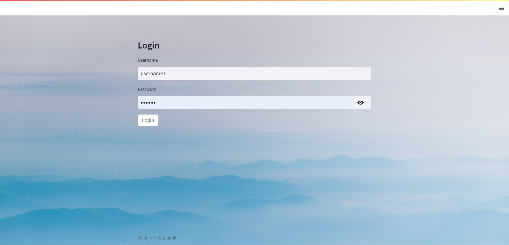
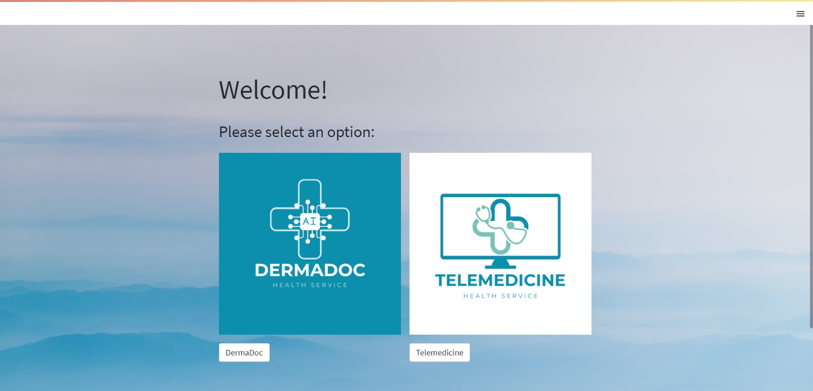
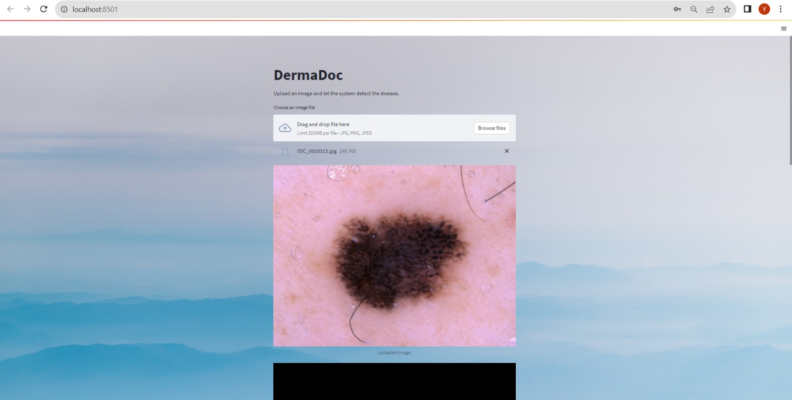
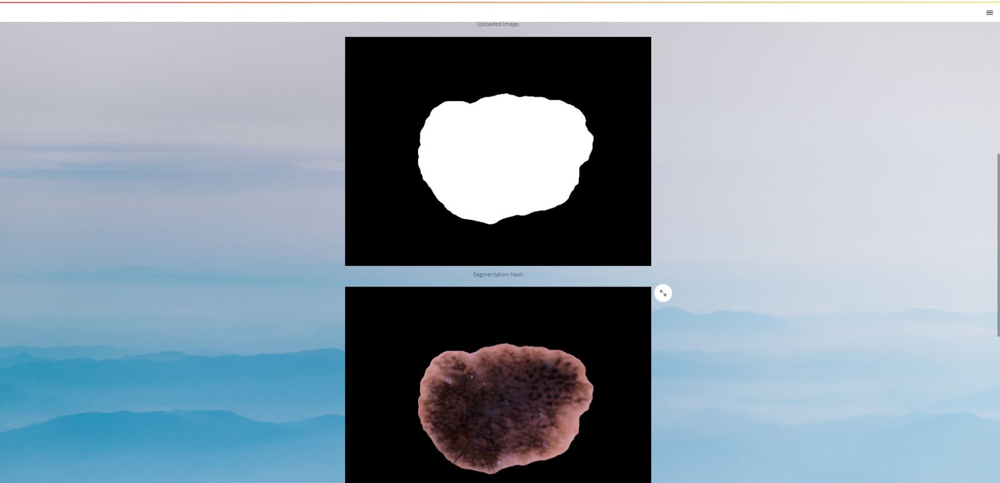
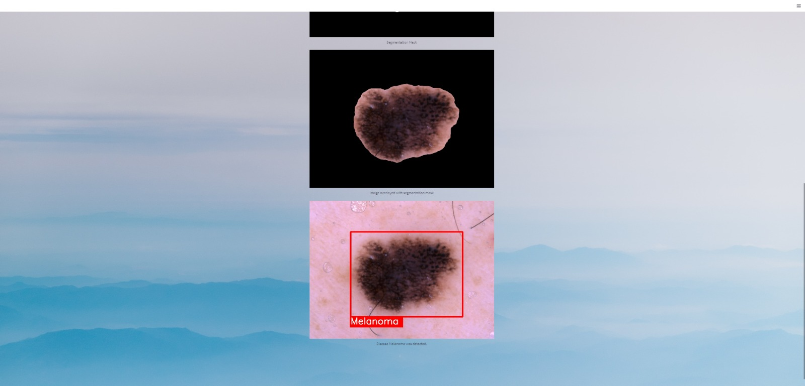
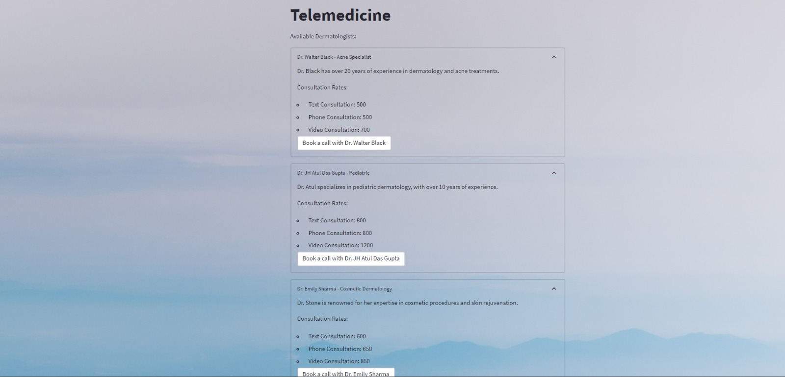

# Derma-Doc
App: AI Algorithm + TeleMedicine

## Problem Statement
Skin diseases and conditions are prevalent around the Globe, affecting people belonging to different age group and different demographic. It faces several challenges, Major being the embarrassment of visiting a doctor, with other problem such as long wait times for appointments, shortage of Dermatologists,etc.

## Features
-Our system uses state-of-the-art artificial intelligence and machine learning algorithms.

-It analyzes high-resolution images of skin lesions taken with a smartphone or digital camera.

-The process is non-invasive, painless, and can be done from the comfort of one's home.

## Roadmap

-Image is taken as an input

-The input image is segmented.Segmentation is required so that the model can focus on the diseased area instead of the whole image.

\- The image coming in is passed through both vgg19 and seresnet152 models and the result is only accepted if combined (sum) confidence of the both models for a single class is greater than 1.

-Confidence is on a scale of 0 to 1, but we are adding 2 confidences so our scale is 0 to 2

-Our accuracy is 91 and sensitivity (true positive rate) is 94. We focused on sensitivity as our key matrix because mis-classification of a deadly disease as a non lethal one is far more dangerous than classifying viceversa .

## Screenshots

